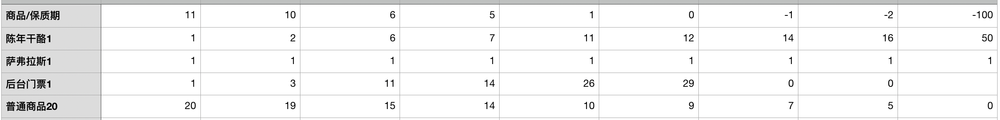

每个商品有两个属性，sellIn与quality，代表当前保质期下商品的价值
每次调用refresh方法，代表距离过期时间近了一天。

#### AgedBrie
- Given AgedBrie is sellIn >= 0 When updating Then increase 1 unit quality
- Given AgedBrie is sellIn < 0 When updating Then increase 2 unit quality
- Given AgedBrie is quality < 0 When updating Then return 0
- Given AgedBrie is quality > 50 When updating Then return 50

#### Sulfuras
- Given Sulfuras When updating Then return original quality
- Given Sulfuras is quality < 0 When updating Then return 0
- Given Sulfuras is quality > 50 When updating Then return 50

#### BackstagePass
- Given BackstagePass is sellIn > 10 When updating Then increase 1 unit quality
- Given BackstagePass is sellIn <= 10, >5 When updating Then increase 2 unit quality
- Given BackstagePass is sellIn <=5 >=0 When updating Then increase 3 unit quality
- Given BackstagePass is quality < 0 When updating Then return 0
- Given BackstagePass is quality > 50 When updating Then return 50

#### CommonGoods
- Given CommonGoods is sellIn >= 0 When updating Then decrease 1
- Given CommonGoods is sellIn < 0 When updating Then decrease 2
- Given CommonGoods is quality < 0 When updating Then return 0
- Given CommonGoods is quality > 50 When updating Then return 50
